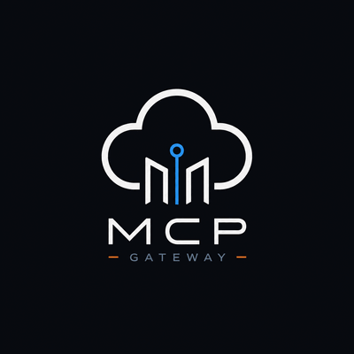

<p align="center">
  
</p>

# AWS MCP Gateway

AWS MCP Gateway is a security-focused [Model Context Protocol](https://modelcontextprotocol.io/) server that lets ChatGPT read selected AWS account data through explicit, read-only tools.

It runs as a Cloudflare Worker, authenticates requests, validates every tool input, signs allowed AWS API calls, and returns normalized results without exposing generic AWS API access.

## What is this?

This project is a self-hosted MCP gateway for connecting ChatGPT to AWS account data in a controlled way.

Instead of giving ChatGPT broad AWS credentials, shell access, or a generic AWS API proxy, the gateway exposes a small set of audited MCP tools. Each tool has a fixed purpose, validated input, bounded output, and read-only AWS permissions.

Every public tool is **manifest-backed**: a `ToolManifest` in `src/mcp/tools/definitions/` is the source of truth for registration, ChatGPT descriptors, AWS capability metadata, and cost-control limits. A central **policy gate** runs before handler execution and fails closed when a tool pack is disabled, cost-control metadata is missing, or request limits are exceeded.

```text
ChatGPT Connector
  -> OAuth / bearer authentication
  -> Cloudflare Worker /mcp endpoint
  -> Manifest-backed tool registry
  -> Policy gate (packs, cost-control, capabilities)
  -> Typed read-only handlers
  -> Signed read-only AWS API requests
  -> Normalized AWS cost, inventory, alarm, and log data
```

The registry defines **14** public tools. Default deployments expose **11** through tool packs (`core`, `cost`, `inventory`, `observability`). Three aggregate overview tools are opt-in via the `aggregates` pack. See [tool exposure](#tool-exposure-optional) and [`docs/aws-capability-matrix.md`](docs/aws-capability-matrix.md).

## Current status

The gateway is currently designed for:

- remote MCP usage over HTTPS;
- ChatGPT custom app connector integration;
- OAuth-based ChatGPT connector authentication;
- local bearer mode development;
- read-only AWS cost, EC2, Lambda, S3, CloudWatch, and CloudWatch Logs inspection.

Production deployments should still run the verification and acceptance checks documented in [`docs/chatgpt-connector-production-acceptance.md`](docs/chatgpt-connector-production-acceptance.md).

## Features

- Remote MCP endpoint at `/mcp`.
- ChatGPT-compatible OAuth connector flow.
- Explicit read-only AWS tools only.
- No generic AWS CLI or arbitrary AWS API proxy.
- Least-privilege IAM policy template.
- Region allowlist and input validation.
- Cloudflare KV caching for AWS-backed tool responses.
- OAuth request rate limiting with a Durable Object.
- Offline unit tests with a fetch guard against accidental network calls.
- Contract checks for MCP tool discovery and ChatGPT connector compatibility.

## Available MCP tools

Default-exposed tools (11 with built-in pack settings):

| Tool | Purpose | Calls AWS |
| --- | --- | --- |
| `search` | Catalog search helper for ChatGPT discovery | No |
| `fetch` | Catalog document helper for tool details | No* |
| `get_gateway_status` | Verify the gateway is reachable and authenticated | No |
| `get_aws_cost_summary` | Return total AWS cost for a bounded date range | Yes |
| `get_aws_cost_by_service` | Return AWS cost grouped by service | Yes |
| `list_ec2_instances` | List EC2 instances in allowed regions | Yes |
| `get_cloudwatch_alarms` | Return CloudWatch alarm states | Yes |
| `get_recent_log_errors` | Return recent CloudWatch Logs errors/warnings | Yes |
| `list_lambda_functions` | List Lambda functions in allowed regions | Yes |
| `list_s3_buckets` | List S3 buckets in the account | Yes |
| `list_log_groups` | List CloudWatch log groups in a region | Yes |

\* `fetch` does not call AWS except when embedding live `get_gateway_status` JSON for that catalog entry.

Full tool contracts — including three opt-in aggregate overview tools — are documented in [`docs/mcp-tools.md`](docs/mcp-tools.md). Platform architecture: [`docs/specs/secure-tool-platform.md`](docs/specs/secure-tool-platform.md).

## When to use it

Use this gateway when you want ChatGPT to answer questions such as:

- “How much did my AWS account spend this month?”
- “Which services are driving my AWS bill?”
- “What EC2 instances are running in my allowed regions?”
- “Are there any CloudWatch alarms in ALARM state?”
- “What Lambda functions are deployed in my allowed regions?”
- “What S3 buckets exist in my account?”
- “Which CloudWatch log groups are defined in us-east-1?”

The project is useful for personal AWS account inspection, lightweight cloud operations, cost visibility, and controlled ChatGPT-based observability workflows.

## When not to use it

Do not use this project as-is if you need:

- AWS write or management operations;
- provisioning, remediation, or infrastructure mutation;
- arbitrary AWS API access;
- a generic AWS CLI over MCP;
- multi-tenant SaaS isolation;
- a dashboard, database, or long-running backend service.

Management tools may be added later only behind stricter security boundaries. See [`docs/post-mvp-boundaries.md`](docs/post-mvp-boundaries.md).

## Requirements

- Node.js `>=22`
- `pnpm` `11.8.0`
- Cloudflare account with Workers enabled
- AWS account with a dedicated read-only IAM user
- Wrangler authentication or a scoped Cloudflare API token
- Auth0 or another OIDC-compatible provider for production ChatGPT OAuth setup

## Quick start: local development

Install dependencies:

```bash
pnpm install
```

Create local runtime secrets:

```bash
cp .dev.vars.example .dev.vars
```

Edit `.dev.vars` and fill:

```text
AWS_ACCESS_KEY_ID=
AWS_SECRET_ACCESS_KEY=
AWS_REGION=us-east-1
AWS_ALLOWED_REGIONS=us-east-1,sa-east-1
AUTH_MODE=local-bearer
MCP_AUTH_TOKEN=
```

**Minimal local loop** (fast iteration during development):

```bash
pnpm run typecheck
pnpm test
pnpm run test:integrity
```

**Full pre-PR / pre-deploy validation** (same gate as [`docs/deployment.md`](docs/deployment.md)):

```bash
pnpm run repo:safety
pnpm run output:guardrail
pnpm run verify:connector-contract
pnpm run typecheck
pnpm test
pnpm run test:integrity
```

`verify:connector-contract` runs typecheck, unit tests, and test-integrity checks; the last three commands are listed explicitly to match CI and deployment docs. Gitleaks secret scanning runs separately on every PR via [`.github/workflows/secret-scan.yml`](.github/workflows/secret-scan.yml).

Start the local Worker:

```bash
pnpm dev
```

The local MCP endpoint is available at:

```text
http://localhost:8787/mcp
```

Local development uses `AUTH_MODE=local-bearer` by default. Production ChatGPT connector deployments should use OAuth.

For the implementation-aligned authentication model, see
[`docs/auth/README.md`](docs/auth/README.md).

## Configuration

Both [`wrangler.jsonc`](wrangler.jsonc) and [`wrangler.example.jsonc`](wrangler.example.jsonc) are tracked and must stay structurally in sync. Edit `wrangler.example.jsonc` first when adding keys or sections, then mirror the same structure into `wrangler.jsonc`. `pnpm run repo:safety` enforces structural parity.

On a fresh clone, if the files differ, copy the example:

```bash
cp wrangler.example.jsonc wrangler.jsonc
```

Update at least:

- `AWS_REGION`
- `AWS_ALLOWED_REGIONS`
- `AUTH_MODE`
- `MCP_RESOURCE_URL`
- `OAUTH_ISSUER`
- `OAUTH_AUDIENCE`
- `OAUTH_JWKS_URI`
- `OAUTH_REQUIRED_SCOPES`
- `kv_namespaces[].id`

Important URL model:

```text
ChatGPT Connector Server URL: https://<worker-host>/mcp
MCP_RESOURCE_URL:              https://<worker-host>
OAUTH_AUDIENCE:                https://<worker-host>
OAuth protected metadata:      https://<worker-host>/.well-known/oauth-protected-resource
```

`MCP_RESOURCE_URL` and `OAUTH_AUDIENCE` must use the Worker origin only. Do not append `/mcp` to those values.

Authentication lifecycle and route responsibilities are documented in
[`docs/auth/README.md`](docs/auth/README.md),
[`docs/auth/oauth-lifecycle.md`](docs/auth/oauth-lifecycle.md), and
[`docs/auth/token-validation.md`](docs/auth/token-validation.md).

### Tool exposure (optional)

Self-hosted deployments can limit which MCP tools are exposed without changing source code. Prefer enabling fewer tools for least privilege.

| Variable | Default | Purpose |
|----------|---------|---------|
| `AWS_MCP_ENABLED_TOOL_PACKS` | `core,cost,inventory,observability` | Comma-separated packs to expose |
| `AWS_MCP_ENABLED_TOOLS` | *(empty — all tools in enabled packs)* | Optional allowlist of tool names |
| `AWS_MCP_DISABLED_TOOLS` | *(empty)* | Tool names to hide and deny |
| `AWS_MCP_MAX_RISK_LEVEL` | `read-only` | Maximum allowed tool risk level |

Tool packs:

```text
core:           search, fetch, get_gateway_status
cost:           get_aws_cost_summary, get_aws_cost_by_service
inventory:      list_ec2_instances, list_lambda_functions, list_s3_buckets
observability:  get_cloudwatch_alarms, get_recent_log_errors, list_log_groups
aggregates:     aws_account_overview, aws_cost_overview, aws_observability_overview (disabled by default)
security:       (no tools yet)
```

The `aggregates` pack is opt-in. Enable it when you want bounded overview tools that compose existing inventory, cost, and observability capabilities. Default deployments expose 11 tools; enabling `aggregates` adds three more.

Exposure rules:

1. The tool's pack must be enabled.
2. The tool must not appear in `AWS_MCP_DISABLED_TOOLS`.
3. When `AWS_MCP_ENABLED_TOOLS` is set, only listed tools are exposed (within enabled packs).
4. The tool's risk level must match `AWS_MCP_MAX_RISK_LEVEL`.

Disabled tools are omitted from `tools/list` and fail safely if called directly. Unknown pack or tool names fail configuration validation.

Example — cost tools only (no core helpers):

```text
AWS_MCP_ENABLED_TOOL_PACKS=cost
```

Example — cost tools plus ChatGPT catalog helpers:

```text
AWS_MCP_ENABLED_TOOL_PACKS=core,cost
```

Example — enable aggregate overview tools:

```text
AWS_MCP_ENABLED_TOOL_PACKS=core,cost,inventory,observability,aggregates
```

## AWS IAM setup

Use a dedicated IAM user with only the permissions required by the gateway.

The canonical read-only policy is maintained at [`infra/aws/iam-readonly-policy.json`](infra/aws/iam-readonly-policy.json).

See [`docs/aws-iam-setup.md`](docs/aws-iam-setup.md) for the complete IAM setup flow. For multi-account access with STS `AssumeRole`, see [`docs/aws-credentials.md`](docs/aws-credentials.md).

Do not use `AdministratorAccess` or broad AWS-managed policies for this gateway.

## Optional KV cache

Cloudflare KV can cache normalized AWS tool responses to reduce repeated AWS API calls and Cost Explorer usage.

Create the namespace:

```bash
wrangler kv:namespace create "AWS_MCP_CACHE"
```

Then copy the returned namespace id into `wrangler.jsonc`.

Default cache TTLs:

| Data | TTL |
| --- | --- |
| AWS cost summary | 30 minutes |
| AWS cost by service | 30 minutes |
| EC2 inventory | 5 minutes |
| Lambda functions | 5 minutes |
| S3 buckets | 5 minutes |
| CloudWatch alarms | 5 minutes |
| Log groups | 5 minutes |
| Recent log events | 5 minutes |

The cache is optional for local development and tests. If the binding is absent, tools run without caching.

**Cost Explorer billing estimates:** Non-cached `ce:GetCostAndUsage` requests are estimated at approximately **US$ 0.01** per live API call. Cached responses report `estimatedCostUsd: 0` and do not make a new Cost Explorer request. These values are approximate gateway estimates only — final AWS billing is determined by your AWS account usage and pricing.

Successful AWS-backed tool responses also expose cache status, AWS request counts, and conservative billing metadata at `structuredContent.execution`. See [`docs/mcp-tools.md#execution-metadata`](docs/mcp-tools.md#execution-metadata).

## Deploy to Cloudflare Workers

Prepare deploy-time credentials:

```bash
cp .env.deploy.example .env.deploy.local
```

Fill the required values in `.env.deploy.local`, then deploy:

```bash
pnpm run deploy:configured
```

Or deploy manually after configuring Worker secrets with Wrangler:

```bash
wrangler secret put AWS_ACCESS_KEY_ID
wrangler secret put AWS_SECRET_ACCESS_KEY
wrangler secret put MCP_AUTH_TOKEN # local-bearer mode only
pnpm deploy
```

For OAuth production mode, configure OAuth values in `wrangler.jsonc` `[vars]` and use Worker secrets only for credentials and private client secrets.

See [`docs/deployment.md`](docs/deployment.md) for the full deployment guide.

## Connect to ChatGPT

This gateway is designed for a ChatGPT custom app connector.

In ChatGPT connector setup, use:

```text
Server URL: https://<worker-host>/mcp
Authentication: OAuth
Scope: aws:read
```

The Worker OAuth resource and audience must be the origin only:

```text
https://<worker-host>
```

After deploying, configure deployment targets (`AWS_MCP_GATEWAY_WORKER_URL`, `AWS_MCP_GATEWAY_AUTH0_DOMAIN` in `.env.deploy.local` or as script arguments), then run:

```bash
pnpm run verify:connector-contract
source .env.deploy.local && pnpm run verify:oauth
pnpm run verify:oauth:authenticated
```

Then create or refresh the ChatGPT connector. The Actions list should expose all **enabled** MCP tools from `tools/list` (11 by default; 14 when the `aggregates` pack is enabled). Disabled or pack-gated tools do not appear as Actions.

Detailed setup and troubleshooting:

- [`docs/chatgpt-connector.md`](docs/chatgpt-connector.md)
- [`docs/auth-chatgpt-oauth.md`](docs/auth-chatgpt-oauth.md)
- [`docs/chatgpt-connector-smoke-test.md`](docs/chatgpt-connector-smoke-test.md)
- [`docs/chatgpt-connector-production-acceptance.md`](docs/chatgpt-connector-production-acceptance.md)

## Security model

The gateway is intentionally read-only.

Required controls:

- MCP requests must be authenticated.
- AWS credentials must be stored outside Git as Cloudflare secrets.
- IAM permissions must be least-privilege and read-only.
- Tools must be explicit and allowlisted.
- Tool inputs must enforce date, region, and result-size limits.
- AWS responses must be normalized before returning to the client.
- Logs and errors must not expose secrets, AWS access keys, bearer tokens, OAuth tokens, or raw stack traces.

Forbidden in the current scope:

- no `run_aws_cli` tool;
- no `call_any_aws_api` or generic AWS API proxy;
- no AWS write or management permissions;
- no raw AWS API responses returned to MCP clients;
- no committed `.env`, `.dev.vars`, `.env.deploy.local`, `.wrangler/`, or real credentials.

For the full security checklist, see [`SECURITY.md`](SECURITY.md).

## Testing

**Minimal local loop:**

```bash
pnpm run typecheck
pnpm test
pnpm run test:integrity
```

**Full pre-PR / pre-deploy validation:**

```bash
pnpm run repo:safety
pnpm run output:guardrail
pnpm run verify:connector-contract
pnpm run typecheck
pnpm test
pnpm run test:integrity
```

- `pnpm run repo:safety` — tracked files stay public-safe (no local env files, secret-like values, or maintainer deployment defaults in Git).
- `pnpm run output:guardrail` — production source routes runtime output through `src/observability/` and does not call `console.*` elsewhere.
- `pnpm run verify:connector-contract` — local ChatGPT Connector contract gate (manifest, policy, capability, exposure, descriptors, `tools/list`).

Tests are offline by default. A global fetch guard fails any unmocked network request during unit tests.

CI runs `repo:safety`, `output:guardrail`, and `verify:connector-contract` in [`.github/workflows/ci.yml`](.github/workflows/ci.yml). Gitleaks secret scanning runs in [`.github/workflows/secret-scan.yml`](.github/workflows/secret-scan.yml).

Runtime MCP/auth dependency upgrades must be treated as protocol changes. See [`docs/dependency-upgrade-contract.md`](docs/dependency-upgrade-contract.md).

## Documentation

| Document | Purpose |
| --- | --- |
| [`docs/mcp-tools.md`](docs/mcp-tools.md) | Public MCP tool contracts |
| [`docs/chatgpt-connector.md`](docs/chatgpt-connector.md) | ChatGPT connector integration guide |
| [`docs/auth/README.md`](docs/auth/README.md) | Authentication lifecycle, route surface, and token validation map |
| [`docs/auth-chatgpt-oauth.md`](docs/auth-chatgpt-oauth.md) | OAuth/Auth0 setup |
| [`docs/chatgpt-connector-production-acceptance.md`](docs/chatgpt-connector-production-acceptance.md) | Production acceptance gate |
| [`docs/chatgpt-connector-smoke-test.md`](docs/chatgpt-connector-smoke-test.md) | Detailed connector smoke runbook |
| [`docs/deployment.md`](docs/deployment.md) | Cloudflare deployment guide |
| [`docs/aws-iam-setup.md`](docs/aws-iam-setup.md) | AWS IAM setup |
| [`docs/aws-credentials.md`](docs/aws-credentials.md) | Default credentials and STS AssumeRole model |
| [`docs/aws-capability-matrix.md`](docs/aws-capability-matrix.md) | Tool-to-IAM capability matrix |
| [`docs/mcp-testing.md`](docs/mcp-testing.md) | Manual MCP smoke tests |
| [`docs/post-mvp-boundaries.md`](docs/post-mvp-boundaries.md) | Future write/management safety boundaries |
| [`docs/dependency-upgrade-contract.md`](docs/dependency-upgrade-contract.md) | MCP/auth dependency upgrade contract |
| [`docs/tooling-conventions.md`](docs/tooling-conventions.md) | Contributor tool conventions |
| [`docs/specs/README.md`](docs/specs/README.md) | When implementation specs are required |
| [`SECURITY.md`](SECURITY.md) | Security checklist and public-safe repository rules |

## Repository safety

Safe to commit:

- source code;
- tests;
- documentation;
- tool schemas;
- example IAM policies;
- example environment files;
- Wrangler configuration without secrets.

Never commit:

- AWS access keys;
- Cloudflare API tokens;
- OAuth client secrets;
- bearer tokens;
- `.env`;
- `.dev.vars`;
- `.env.deploy.local`;
- `.wrangler/`.

## Contributing

Before opening a pull request, run the full pre-PR validation block from [Testing](#testing) (all six commands). When changing MCP descriptors, tool manifests, or connector discovery, `pnpm run verify:connector-contract` is required.

Use conventional commits:

```text
type(scope): message
```

Examples:

```text
docs(readme): improve setup guide
feat(mcp): add read-only budget status tool
fix(auth): reject tokens without required scope
security(aws): tighten IAM policy actions
```

Pull requests that change public tool behavior should update [`docs/mcp-tools.md`](docs/mcp-tools.md) and include focused contract tests.

## License

MIT. See [`LICENSE`](LICENSE).

## Disclaimer

This project is not affiliated with AWS, Cloudflare, OpenAI, or Auth0. Use it with dedicated credentials, least-privilege IAM permissions, and your own security review before production use.
