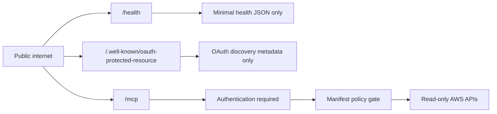
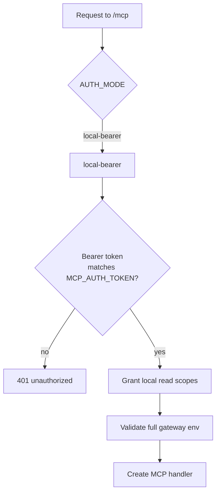

# Authentication overview

This directory explains how the AWS MCP Gateway authenticates requests in a way
that matches the current Worker implementation.

The core rule is simple:

> Public URL does not mean public access.

The Worker is expected to be reachable on the public internet so ChatGPT can
discover and call it, but only a small public surface stays open:

- `/health` is a minimal public liveness endpoint.
- `/.well-known/oauth-protected-resource` is public OAuth discovery metadata in
  `AUTH_MODE=oauth`.
- `/mcp` is network-public but requires authentication before MCP execution.

Security does not depend on hiding the Worker URL. The protection boundary is
request authentication, scope checks, policy gates, read-only IAM, and
normalized output.

## Route model

## Auth modes

| Mode | Purpose | Required auth config | Detailed docs |
| --- | --- | --- | --- |
| `oauth` | Production ChatGPT Connector usage | `MCP_RESOURCE_URL`, `OAUTH_ISSUER`, `OAUTH_AUDIENCE`, `OAUTH_REQUIRED_SCOPES`, validation-mode vars, OAuth rate-limit binding | [OAuth lifecycle](oauth-lifecycle.md), [token validation](token-validation.md), [routes and public surface](routes-and-public-surface.md) |
| `local-bearer` | Local/manual/private access | `MCP_AUTH_TOKEN` | [routes and public surface](routes-and-public-surface.md) |

`AUTH_MODE` defaults to `local-bearer` when absent. Production ChatGPT
deployments should use `AUTH_MODE=oauth`.

## Local bearer mode

`AUTH_MODE=local-bearer` is intentionally separate from the ChatGPT production
OAuth path:

- It requires `MCP_AUTH_TOKEN`.
- It does not use `/.well-known/oauth-protected-resource`.
- It is meant for local/manual/private usage.
- In production OAuth mode, `MCP_AUTH_TOKEN` is not required and should usually
  be absent.

## Secrets and non-secrets

### Secrets

- `AWS_ACCESS_KEY_ID`
- `AWS_SECRET_ACCESS_KEY`
- `AWS_SESSION_TOKEN` if used
- `MCP_AUTH_TOKEN` in `local-bearer` mode
- `OAUTH_INTROSPECTION_CLIENT_SECRET` in `introspection` or `hybrid` mode
- `CLOUDFLARE_API_TOKEN`
- Auth0 Management API secrets
- OAuth client secrets

### Non-secret operational config

- `MCP_RESOURCE_URL`
- `OAUTH_ISSUER`
- `OAUTH_AUDIENCE`
- `OAUTH_JWKS_URI`
- `OAUTH_REQUIRED_SCOPES`
- `AUTH_MODE`
- `OAUTH_TOKEN_VALIDATION_MODE`
- `AWS_REGION`
- `AWS_ALLOWED_REGIONS`
- KV namespace IDs
- Durable Object binding names
- rate-limit values

The public Worker URL, Auth0 issuer, JWKS URL, audience/resource URL, and KV
namespace ID are identifiers and configuration. They are not access credentials
by themselves.

## Reading order

1. [routes-and-public-surface.md](routes-and-public-surface.md) for route
   responsibilities and the public surface.
2. [oauth-lifecycle.md](oauth-lifecycle.md) for the ChatGPT Connector lifecycle.
3. [token-validation.md](token-validation.md) for JWT, introspection, and
   hybrid token validation.
