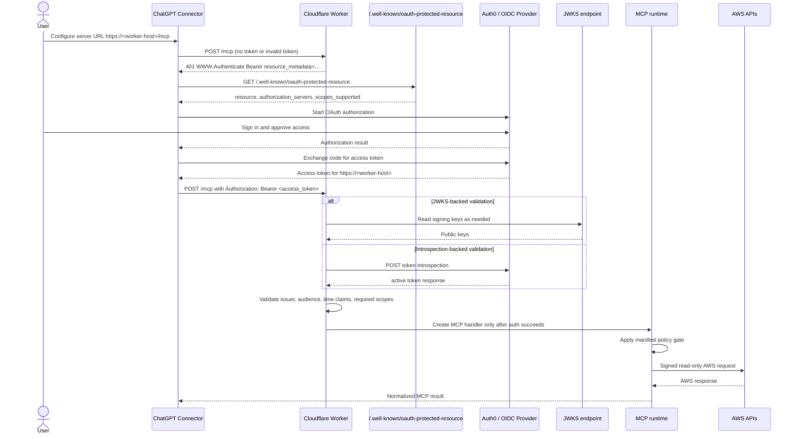

# OAuth lifecycle

This document explains the expected authentication lifecycle when the gateway is
deployed with `AUTH_MODE=oauth`.

## High-level model

ChatGPT is configured with the Worker MCP endpoint:

```text
https://<worker-host>/mcp
```

The protected resource metadata and OAuth audience stay on the Worker origin
without `/mcp`:

```text
MCP_RESOURCE_URL=https://<worker-host>
OAUTH_AUDIENCE=https://<worker-host>
```

The Worker is an OAuth resource server. It does not act as the authorization
server. An external OIDC/OAuth provider issues access tokens; the Worker
validates them before any MCP handler is created.

## ChatGPT Connector lifecycle

1. ChatGPT is configured with `https://<worker-host>/mcp`.
2. ChatGPT calls `/mcp` without a token or with an invalid or expired token.
3. The Worker returns `401 Unauthorized` with `WWW-Authenticate: Bearer ...`.
4. The challenge points to `/.well-known/oauth-protected-resource` through
   `resource_metadata`.
5. ChatGPT fetches the protected resource metadata.
6. ChatGPT starts OAuth authorization with the configured authorization server.
7. The user authorizes access.
8. ChatGPT obtains an access token for the configured resource and scopes.
9. ChatGPT retries `/mcp` with `Authorization: Bearer <access_token>`.
10. The Worker validates issuer, audience, token time claims, and required
    scopes, plus signature or introspection status depending on the configured
    validation mode.
11. The MCP request proceeds only after successful authentication.

The well-known route is a discovery document. It is not a protected tool route,
and it is not fetched before every tool call once the client already has a
usable access token.

## End-to-end sequence



## What the challenge communicates

In OAuth mode, unauthenticated `/mcp` requests return a normalized `401`
response with a `WWW-Authenticate` challenge that includes:

- `resource_metadata` pointing at
  `https://<worker-host>/.well-known/oauth-protected-resource`
- `scope` listing the required scopes such as `aws:read`
- `error="invalid_token"` when the request is missing a valid token

If the token is valid but missing required scopes, the Worker returns `403` with
an `insufficient_scope` challenge instead.

## Relationship to local bearer mode

Local bearer mode exists for local/manual/private usage. It does not participate
in ChatGPT OAuth discovery and does not expose protected resource metadata.

For route-by-route behavior, see
[routes-and-public-surface.md](routes-and-public-surface.md). For validation
mode details, see [token-validation.md](token-validation.md).
