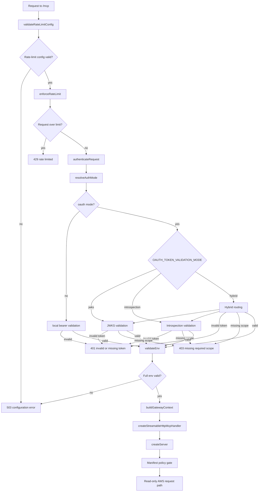

# Routes and public surface

This document explains why the Worker can be publicly reachable while still
protecting AWS-backed MCP execution.

## Public URL does not mean public tool access

The Worker URL must be reachable by ChatGPT and other OAuth participants over
HTTPS. That does not mean AWS data or MCP tools are public.

The implementation keeps a narrow public surface and authenticates `/mcp` before
MCP runtime creation:

- `/health` is intentionally public and minimal.
- `/.well-known/oauth-protected-resource` is intentionally public discovery
  metadata in OAuth mode.
- `/mcp` is public at the network layer but protected at the application layer.

## Route responsibilities

### `/health`

- Public.
- No authentication required.
- Returns only minimal availability information.
- Does not validate AWS credentials.
- Does not expose environment, secrets, region lists, tool lists, deploy hash,
  account metadata, cache internals, or OAuth internals.

Current implementation returns a small JSON payload:

```json
{
  "ok": true,
  "service": "aws-mcp-gateway"
}
```

### `/.well-known/oauth-protected-resource`

- Public when `AUTH_MODE=oauth`.
- Returns protected resource metadata built from validated OAuth config.
- Used by OAuth clients to discover the resource URL, authorization server,
  supported scopes, and resource documentation URL.
- Does not execute MCP tools.
- Does not call AWS.
- Does not expose secrets.
- Returns `404` outside OAuth mode.

### `/mcp`

- Network-public but authentication-protected.
- Validates rate-limit configuration before request execution.
- Enforces rate limiting before authentication reaches the MCP runtime.
- Resolves the auth mode and authenticates the request.
- Returns `401` for missing or invalid credentials.
- Returns `403` for valid credentials missing required scope.
- Validates the full runtime environment only after auth succeeds.
- Builds the gateway context with granted scopes.
- Creates the MCP handler only after auth succeeds.
- Routes tool calls through manifest policy gates before any AWS request.

## `/mcp` internal flow



## Why the public routes stay narrow

The public routes support discovery and liveness without exposing AWS access:

- `/health` answers "is the Worker up?"
- `/.well-known/oauth-protected-resource` answers "how should an OAuth client
  discover this protected resource?"
- `/mcp` answers only after authentication and policy checks succeed

This is why hiding the Worker URL is not the security model. The security model
is explicit authentication, required scopes, strict configuration validation,
policy gates, read-only AWS permissions, and normalized responses.

## Related docs

- [README](README.md)
- [oauth-lifecycle.md](oauth-lifecycle.md)
- [token-validation.md](token-validation.md)
- [../auth-chatgpt-oauth.md](../auth-chatgpt-oauth.md)
