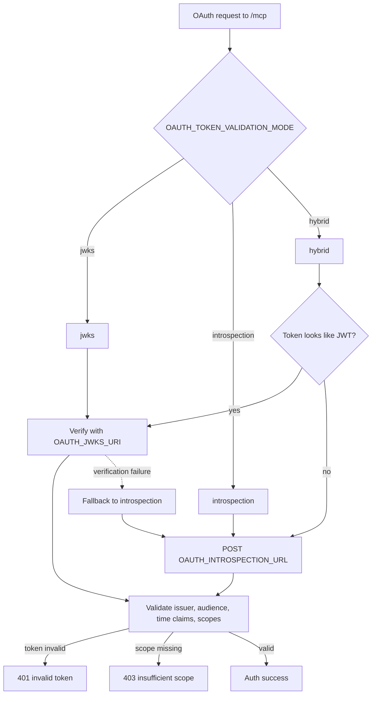

# Token validation

This document explains how `/mcp` validates OAuth access tokens when
`AUTH_MODE=oauth`.

## What is always validated

Regardless of validation mode, the Worker requires:

- an `Authorization: Bearer <token>` header;
- a token that matches the configured issuer;
- an audience or resource that matches `OAUTH_AUDIENCE`;
- valid token time claims such as `exp` and `nbf` when present;
- every configured scope in `OAUTH_REQUIRED_SCOPES`.

If token validation fails, `/mcp` returns `401`. If the token is otherwise valid
but missing required scope, `/mcp` returns `403`.

## Validation mode comparison

| Mode | Intended use | Required env vars | Secret required | Behavior |
| --- | --- | --- | --- | --- |
| `jwks` | Recommended production default for Auth0-compatible JWT access tokens | `MCP_RESOURCE_URL`, `OAUTH_ISSUER`, `OAUTH_AUDIENCE`, `OAUTH_REQUIRED_SCOPES`, `OAUTH_JWKS_URI` | No additional OAuth secret | Verifies JWT locally with public keys, then checks issuer, audience, token time claims, and scopes |
| `introspection` | Use when opaque tokens or centralized active-token checks are required | `MCP_RESOURCE_URL`, `OAUTH_ISSUER`, `OAUTH_AUDIENCE`, `OAUTH_REQUIRED_SCOPES`, `OAUTH_INTROSPECTION_URL`, `OAUTH_INTROSPECTION_CLIENT_ID`, `OAUTH_INTROSPECTION_CLIENT_SECRET` | `OAUTH_INTROSPECTION_CLIENT_SECRET` | Calls the introspection endpoint, requires `active=true`, then checks issuer when present, audience, token time claims, and scopes |
| `hybrid` | Optional mixed mode for JWT-first validation with introspection fallback | All `jwks` vars and all `introspection` vars | `OAUTH_INTROSPECTION_CLIENT_SECRET` | Uses JWKS for JWTs, uses introspection for opaque-looking tokens, and falls back to introspection if JWT verification fails |

## Validation mode diagram



## `jwks`

`jwks` is the default when `OAUTH_TOKEN_VALIDATION_MODE` is unset.

Recommended configuration:

```text
AUTH_MODE=oauth
MCP_RESOURCE_URL=https://<worker-host>
OAUTH_ISSUER=https://<auth0-tenant>/
OAUTH_AUDIENCE=https://<worker-host>
OAUTH_TOKEN_VALIDATION_MODE=jwks
OAUTH_JWKS_URI=https://<auth0-tenant>/.well-known/jwks.json
OAUTH_REQUIRED_SCOPES=aws:read
```

Use this mode when the provider issues JWT access tokens signed with a public
key the Worker can validate locally.

## `introspection`

Use introspection when token format or operational requirements make remote
active-token checks necessary.

Required configuration:

```text
AUTH_MODE=oauth
MCP_RESOURCE_URL=https://<worker-host>
OAUTH_ISSUER=https://<auth0-tenant>/
OAUTH_AUDIENCE=https://<worker-host>
OAUTH_TOKEN_VALIDATION_MODE=introspection
OAUTH_INTROSPECTION_URL=https://<auth-provider>/oauth/introspect
OAUTH_INTROSPECTION_CLIENT_ID=<client-id>
OAUTH_INTROSPECTION_CLIENT_SECRET=<client-secret>
OAUTH_REQUIRED_SCOPES=aws:read
```

`OAUTH_INTROSPECTION_CLIENT_SECRET` is a secret and should be stored as a
Cloudflare Worker secret, not as a plain `wrangler.jsonc` variable.

## `hybrid`

`hybrid` supports both local JWT validation and introspection fallback.

Required configuration:

```text
AUTH_MODE=oauth
MCP_RESOURCE_URL=https://<worker-host>
OAUTH_ISSUER=https://<auth0-tenant>/
OAUTH_AUDIENCE=https://<worker-host>
OAUTH_TOKEN_VALIDATION_MODE=hybrid
OAUTH_JWKS_URI=https://<auth0-tenant>/.well-known/jwks.json
OAUTH_INTROSPECTION_URL=https://<auth-provider>/oauth/introspect
OAUTH_INTROSPECTION_CLIENT_ID=<client-id>
OAUTH_INTROSPECTION_CLIENT_SECRET=<client-secret>
OAUTH_REQUIRED_SCOPES=aws:read
```

This mode is more complex than `jwks` and is optional. It is not the
recommended MVP default.

## Audience and resource URL rule

`MCP_RESOURCE_URL` and `OAUTH_AUDIENCE` must be the Worker origin only:

```text
https://<worker-host>
```

Do not append `/mcp` to those values.

The ChatGPT Connector server URL remains:

```text
https://<worker-host>/mcp
```

## Local bearer reminder

`MCP_AUTH_TOKEN` is unrelated to OAuth token validation. It is required only in
`AUTH_MODE=local-bearer` and is normally absent in production OAuth mode.
